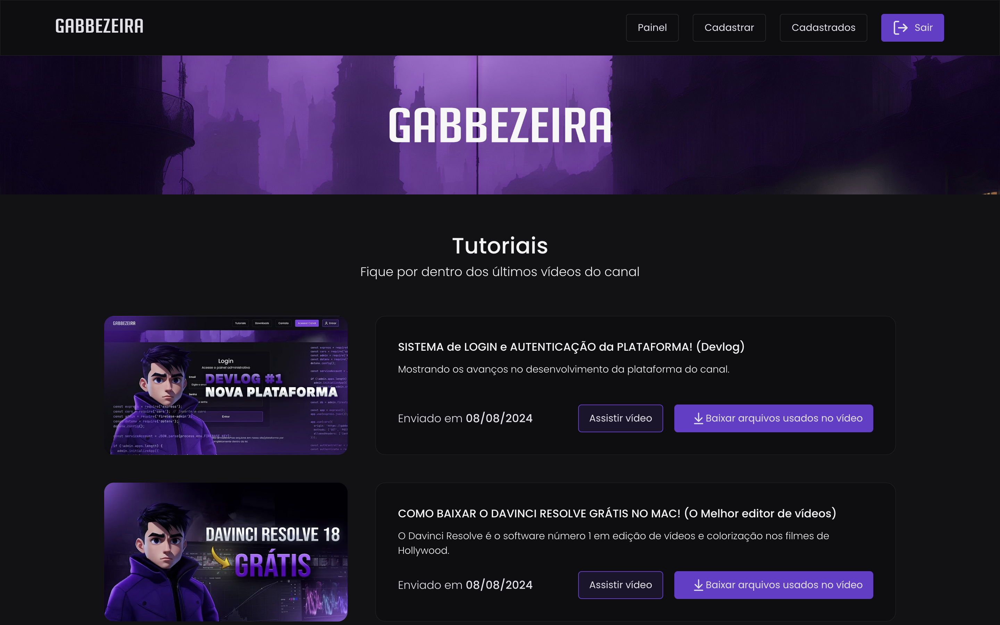
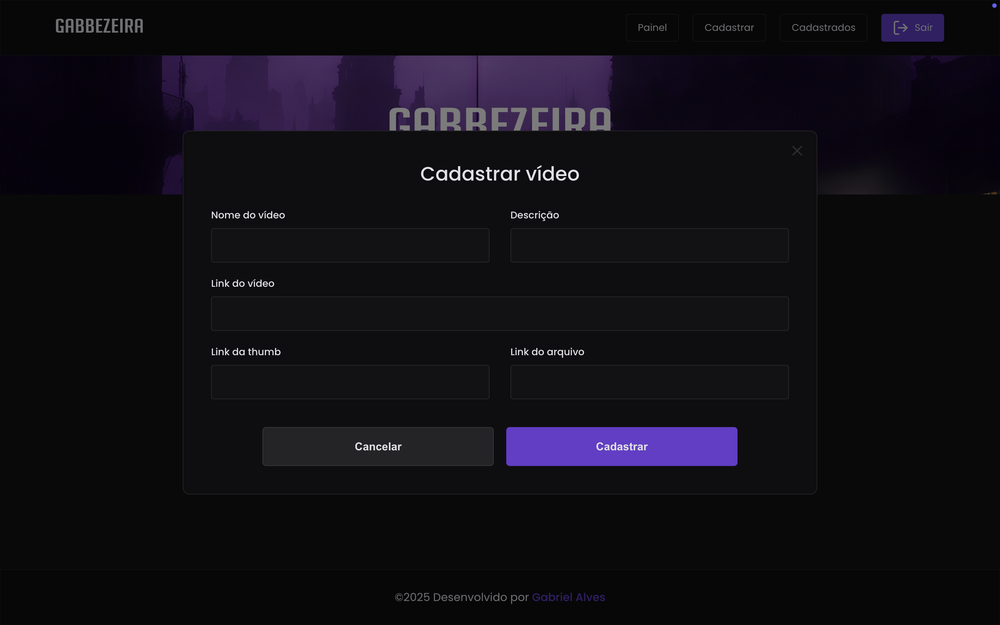
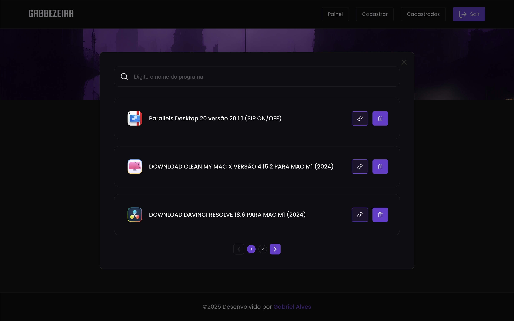

# Plataforma Gabbezeira

Essa é a plataforma que desenvolvi para meu canal do youtube, ela conta com sistema de autenticação com JWT, alertas (snackbar), sistema de cadastro de contéudo, sistema de upload, URL amigáveis para as páginas dos programas, dentre diversas outras funcionalidades. O sistema tem API própria feita em node e o banco de dados é o firebase. Este é meu maior projeto até então, e fiz completamente sozinho.(https://gabbezeira.vercel.app)

### Acessar

## 🔧 Tipo de Projeto

- Site Responsivo

## Feito Com:

### Support Ou Contato

Copyright © 2024 Gabriel Alves

